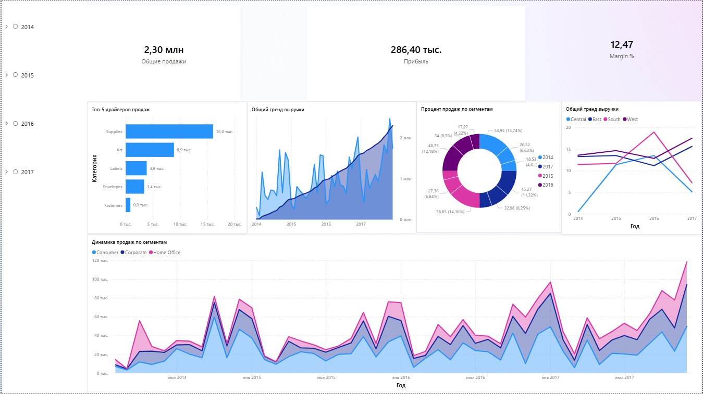

# SuperStore Sales Analysis

Анализ продаж и визуализация данных на основе датасета SuperStore (2014–2017).

## Цель
Отработка навыков сложной SQL-трансформации данных и построения интерактивных дашбордов в Power BI.

## Стек
- PostgreSQL (SQL-запросы)
- Power BI (Визуализация)
- DBeaver (IDE)

## Ключевые метрики
- Выручка, Прибыль, Маржинальность
- Динамика по сегментам и регионам
- Скользящие средние и накопительные итоги

