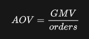
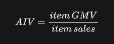
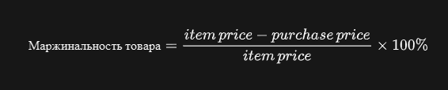
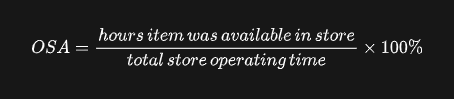
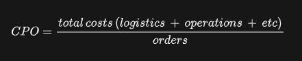
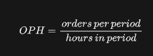
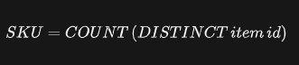
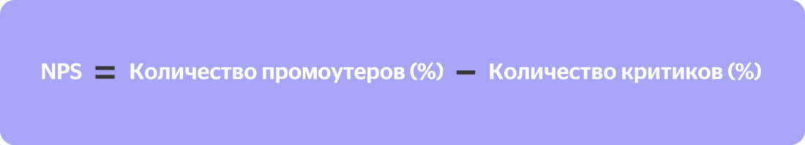
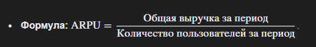

## Метрики
1. GMV - показывает сколько денег получила компания за продажи товаров. 

2. AOV - Средняя стоимость одного заказа. Необходимо разделить GMV на количество заказов

3. AIV - Средняяя цена товара, рассчитывается как отношение GMV на количество проданного товара

4. Маржинальность товара - отражает наценку на товар. Для подсчета необходимо вычесть из цены товара его изначальную себестоимость, поделить найденную разницу на цену товара, после умножить это отношение на 100% 

5. OSA  - Доступность товаров на полке магазина. Отражает долю времени, которое товар был доступен для заказа (Вряд ли пригодится в Olist)

6. СPO - расходы на заказ. Отражает количество денег, которое компания тратит на 1 заказ.

7. ОРН - Количество заказов в час/день/месяц/год и тд. Отражает количественное значение заказов за определенный период

8. SKU - Размер товарной матрицы в магазине. Простейшая метрика.

9. CLTV - Пожизненная ценность клиентов 
Средняя стоимость заказа * частота покупок * время жизни

10. NPS - насколько продукт нравится пользователям / покупателям 

11. ARPU - средняя выручка на пользователя

