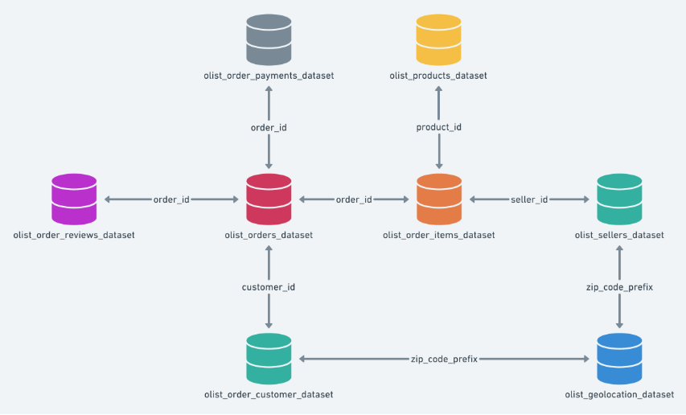

## Разведка и значение таблиц в Olist 
* **orders_dataset** - Содержит информацию о заказах и времени их доставки. Включает в себя такие поля как: 
    - order_id - айди заказа
    - customer_id - id покупателя
    - order_status - статус заказа
    - order_purchase_timestamp - время совершения покупки
    - order_approved_at - время подтверждения заказа
    - order_delivered_carrier_date - дата и время доставки заказа поставщиком
    - order_delivered_customer_date - дата и время доставки заказа клиенту
    - order_estimated_delivery_date - ожидаемая дата доставки
* **order_items_dataset** - Отражает состав заказа, поставщика, цену каждого конкретного товара в заказе и стоимость доставки
    - order_id - id заказа
    - order_item_id - id каждого конкретного товара в заказе
    - product_id - id конкретного товара на площадки
    - seller_id - id продавца
    - shipping_limit_date - Дедлайн отгрузки товара продавцом
    - price - стоимость товара 
    - freight_value - Стоимость доставки
* **order_reviews_dataset** - Таблица с отзывами и оценками приобретенных товаров покупателями
    - review_id - id конкретного отзыва
    - order_id - id заказа
    - review_score - оценка пользователя о товаре от 1 до 5
    - review_comment_title - заговолок отзыва
    - review_comment_message - тело отзыва
    - review_creation_date - дата создания / написания отзыва
    - review_answer_timestamp - Время фиксации отзыва
* **sellers_dataset** - таблица с информацией о продавцах
    - seller_id - id продавца
    - seller_zip_code_prefix - префикс почтового индекса продавца
    - seller_city - город нахождения продавца
    - seller_state - штат местонахождения продавца
* **geolocation_dataset** - таблица с информацией о местоположении покупателей и продавцов, которая определяется по префиксу почтового индекса
    - geolocation_zip_code_prefix - префикс почтового индекса
    - geolocation_lat - широта
    - geolocation_lng - долгота
    - geolocation_city - город местонахождения
    - geolocation_state - штат местонахождения
* **customers_dataset** - Таблица с информацией о покупателях
    - customer_id - id покупателя. используется как ключ (Используется как ключ онли)
    - customer_unique_id - уникальное id человека (Используем для рассчет RR & CLV так как поле отражает реальных пользователей)
    - customer_zip_code_prefix - префикс почтового индекса покупателя
    - customer_city - город, в котором живет покупатель
    - customer_state - штат покупателя
* **order_payments_dataset** - Таблица с информацией о платежах
    - order_id - id заказа
    - payment_sequential - номер платежа внутри заказа
    - payment_type - способ оплаты
    - payment_installments - количество рассрочек. Метаданные
    - payment_value (Для рассчета необходимо использовать SUM так как заказ может быть оплачен разными методами) - сумма платежа
* **products_dataset** - таблица отражающая подробные сведения о товаре
    - product_id - id товара
    - product_category_name - категория товара на площадке
    - product_name_lenght - длина наименования товара
    - product_description_lenght - длина описания товара
    - product_photos_qty - количество фотографии товара
    - product_weight_g - вес товара в граммах
    - product_lenght_cm - длина товара сантиметры 
    - product_height_cm - высота товара в сантиметрах
    - product_width_cm - ширина товара в сантиметрах
    
    

## Анализ протекает в рамках и соответствии с AARRR воронкой 
### Ключевые метрики каждой корзины 
* **A (Привлечение)** - Недостаточно данных. Невозможно оценить привлечение людей по данным о продажах
* **A (Активация)** - Кастомная метрика исследования направленная на оценку успешности активации покупателя (Доставка) цель - оценить успешность активации (Успешная доставка) и оценить факторы которые могли бы (и возможно помешали) активации (Любые проблемы с доставкой) и действительно ли активация не удалась (ПОльзователь больше не заказывал). 
* **R (Удержание)** - Retetion Rate и OPH - Группа метрик, отражающая какая часть пользователей заказали больше одного раза и сколько при этом людей делают заказы ежемесячно
* **R (Рекомендация)** - NPS (Индекс лояльности) 
* **R (Выручка)** - GMV, AOV, ARPU. Ключевая GMV 

**Дополнительно можно использовать SKU для отражения размера товарной матрицы, Исследовать влияет ли время доставки на оценку товара**
-
## Elevator pitch 
Я исследую площадку Olist для того, что понять как у неё дела с привлечением и удержанием пользователей и привдят ли её действия к повышению лояльности увеличению выручки площадки в каждой категории товаров. Для анализа используется AARRR воронка
## Бизнес вопросы 
* **1.** - Насколько четко выражена зависимость между удержанием клиентов и GMV компании
* **2.** - Влияет ли средняя оценка пользователей в категории на GMV всей категории?
* **3.** - Какую часть ежемесячной прибыли площадке приносят новые клиенты (Те которые до этого не совершали новых заказов), а какую част прибыли приносят постоянные пользователи (Совершавшие до этого заказы). 

